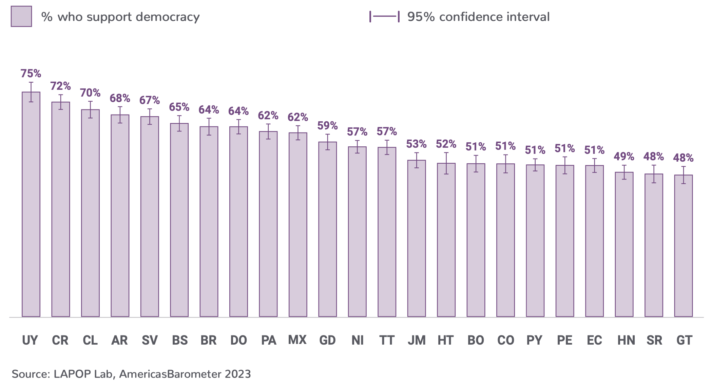

# Introducción

En este documento se verán aspectos básicos del uso de R y RStudio.

# Objetos

En la sección anterior se mencionó que el Environment muestra los objetos creados. En R se puede crear objetos y luego manipularlos. Por ejemplo, el gráfico muestra el porcentaje de personas que apoyan a la democracia en cada país. Si queremos guardar el resultados de Uruguay (UY), podemos crear un objeto.

{width="491"}

La siguiente línea de código crea un objeto llamado "UY" que almacena el número 80. Esto objeto se muestra en el Environment, tanto el nombre, como el valor que almacena.

```{r objeto}
UY = 80
HT = 46
```

Si quisiéramos calcular la diferencia en porcentaje entre Uruguay, el país que muestra el mayor apoyo a la democracia, y Haití, el que muestra el menor porcentaje, se puede calcular haciendo la resta del objeto menos el valor del porcentaje en Haití. Cuando se corre este código, RStudio nos muestra el resultado.

```{r resta}
UY - HT
```

Los objetos en R no solo almacenan números, sino que también pueden guardar letras (o cadenas de caracteres).

El Barómetro de las Américas recoje información de casi todos los países de las Américas. La tabla siguiente muestra los países en los que se ha recogido información en alguna ronda.

{width="552"}

Si queremos guardar el nombre de un país en un objeto, se puede nombrar al objeto "pais1" y escribir el nombre del país (que es una cadena de caracteres) entre comillas.

```{r pais}
pais1 = "México"
```

Como se observa, el nombre del objeto no lleva tilde. Es posible crear un objeto con tildes, pero se recomienda no hacerlo pues puede crear problemas posteriores. La cadena de caracteres "México" sí incluye la tilde. Esto no representa ningún problema.

# Vectores

Un vector es un objeto que contiene un conjunto de elementos, sean números o cadenas de caracteres, entre otros. Por ejemplo, podemos crear un vector que almacene todos los porcentajes del Gráfico 1.1.

```{r vector porcentajes}
apoyo = c(80, 73, 71, 69, 68, 67, 66, 63, 63, 63, 62, 61, 61, 57, 53, 52, 50, 50, 49, 46)
```

De manera similar, podemos crear un vector con los nombres (o siglas) de los países.

```{r vector pais}
pais = c("UY", "SV", "CR", "AR", "CL", "BR", "GY", "MX", "EC", "NI", "DO", "PN", "BO", "JA", "CO", "GT", "PY", "PE", "HN", "HT")
```

No es necesario seguir el mismo orden del gráfico; sin embargo, es recomendable por razones que se explicarán más abajo.

Se puede seleccionar elementos particulares de un vector usando `[…]`. Por ejemplo, si queremos seleccionar el país de Argentina, tanto su nombre, como su porcentaje, se tiene que colocar entre corchetes la posición en la que se encuentra.

```{r seleccionar vector}
pais[4]
apoyo[4]
```

# Funciones

Una función es un procedimiento que recibe un input y produce un output. Por ejemplo, la función Y = X\^2, recibe un valor X cualquiera, por ejemplo 2, y devuelve un valor Y, en este caso 4. En R se tienen las funciones algebraicas, como raíz cuadrada o logaritmo. Por ejemplo, la función `log(…)` recibe un valor X y devuelve un valor Y igual al logaritmo de X.

```{r raiz}
sqrt(36) #por squared root
log(20)
```

También se puede aplicar una función a un conjunto de datos, como los almacenados en un vector. Por ejemplo, si quisiéramos calcular la tasa de personas que apoya a la democracia por cada 1000 habitantes en todos los países, tendríamos que multiplicar el vector "pais" entre 10. En este caso, la función de multiplicación se aplica a cada elemento del vector.

```{r apoyo2}
apoyo2 = apoyo*10
apoyo2
```

Hay otras funciones que resultan más útiles para nuestros objetivos porque trabajan sobre un conjunto de valores, como los almacenados en un vector, calculando un valor único. Por ejemplo, si queremos calcular el apoyo a la democracia promedio en todos los países mostrados en el Gráfico 1.1 se puede usar la función `mean(…)`.

```{r media}
mean(apoyo)
```

Esta función recibe todos los valores de un vector, los suma y los divide entre el número de observaciones, mostrando la media (o promedio).

Otra funciones muy usadas en estadística son la mediana, la desviación estándar, el mínimo, el máximo y la suma.

```{r otras funciones}
median(apoyo)
sd(apoyo)
min(apoyo)
max(apoyo)
sum(apoyo)
```

El Gráfico 1.1 muestra los resultados para los países donde se tiene información. Sin embargo, en algunos casos un vector puede incluir un valor perdido. Por ejemplo, el gráfico no muestra información para Venezuela, país donde no se realizó trabajo de campo por motivos de seguridad. Si quisiéramos crear un vector que incluya este valor faltante, se podría hacer así:

```{r apoyo con NA}
apoyo2 = c(apoyo, NA)
apoyo2
```

En el procedimiento que hemos realizado hemos usado el mismo nombre "apoyo2", por lo que hemos sobreescrito el vector con estos nuevos resultados. La cadena de número ahora incluye un valor final NA.

Algunas funciones NO pueden calcular directamente su procedimiento en vectores que contienen valores NA. Por ejemplo, la función `mean`.

```{r media apoyo2}
mean(apoyo2)
```

El cálculo directo de la media del vector "apoyo2" nos devuelve un resultado NA. Para poder hacer el cálculo, indicándole a la función que no tome en cuenta este valor NA, se tiene que usar la especificación `na.rm=True`.

```{r media apoyo na.rm}
mean(apoyo2, na.rm=T)
```

# Paquetes

R es un proyecto colaborativo. Muchos desarrolladores producen nuevos paquetes que son administrados por el mismo proyecto de R. Estos paquetes pueden incluir muchas funciones que ayudan a manejar datos.

Por ejemplo, R tiene funciones nativas para importar bases de datos de diferentes formatos, como Excel, SPSS o Stata. Cada formato tiene una función específica, como `read_csv` o `read_dta`. Sin embargo, unos desarrolladores han producido un paquete llamado "rio" que incluye una función `import` que permite importar cualquier tipo de base de datos. Este paquete no viene instalado en la descarga básica de R, por lo que se tiene que instalar el paquete para poder usarlo.

Para instalar un paquete se usa el comando `install.packages` con el nombre del paquete que se quiere instalar entre comillas. En este caso hemos usado un \# antes del código debido a que ya se tiene instalado el paquete. Esto sirve para mostrar que los comentarios o líneas de código que queremos mostrar, pero que no se corran, se pueden hacer con un \# antes del comentario o código.

```{r instalar paquetes}
#install.packages("rio")
```

Una vez instalado, se tiene que activar el paquete para poder usar sus funciones. Esto se hace con el comando `library`. Una vez activado, se puede usar cualquier función de esta librería, como la función `import`. Para activar ya no se requiere comillas. Este procedimiento se puede verificar en el panel inferior derecho, en la pestaña "Packages". El paquete "rio" aparece con un check.

```{r activar}
library(rio)
```

# Dataframes

Los dataframes son estructuras de datos rectangulares. Como convención, los dataframes tienen en sus columnas a los vectores y en las filas a las observaciones. Para crear un dataframe se usa el comando `data.frame(...)`.

Por ejemplo, podemos crear un dataframe que junte los datos del vector "pais" con los del vector "apoyo". Estos dos vectores tienen que tener las mismas dimensiones. Vemos en el Environment que ambos tienen como dimensión [1:20]. Este dataframe se puede guardar en un objeto "apoyoAL".

```{r dataframe}
apoyoAL = data.frame(pais, apoyo)
apoyoAL
```

Vemos que el objeto "apoyoAL" se ha guardado en una sección aparte del Environment que se llama "Data". Este objeto tiene 20 observaciones (es decir, 20 filas o países) y dos variables (es decir, dos vectores o dos columnas). Se puede hacer click en este objeto y se puede ver la plancha de datos en una pestaña aparte.

Si se quisiera hacer un dataframe con los vectores "pais" y "apoyo2", R nos daría un mensaje de error debido a que estos vectores tienen diferentes dimensiones.

Ahora, el vector "apoyo" forma parte de la base de datos "apoyoAL". Para poder usar las funciones en un dataframe se debe especificar la columna de la que se quiere calcular la función. Por ejemplo, si ahora se quisiera calcular el promedio de apoyo a la democracia desde la base de datos "apoyoAL" se tiene que especificar la columna con "\$".

```{r apoyo data}
mean(apoyoAL$apoyo)
```

En general, cualquier base de datos es una estructura rectangular donde en las filas tenemos las observaciones y en las columnas, las variables, lo que cambia es el número de filas y de columnas.

Por ejemplo, una base de datos del Barómetro de las Américas de un país puede tener 1,500 observaciones (1,500 filas) y más de 100 variables (más de 100 columnas). En ese caso, cada observación corresponde a una persona que respondió la encuesta y una columna (o vector de datos) representa las respuestas de todos los entrevistados a una pregunta del cuestionario.

Es más, la base de datos conjunta (el merge de datos) es la base de datos de todos los países. Esta base de datos puede tener más de 30 mil observaciones (es decir, todos los entrevistados en todos los países en una ronda determinada) y más de 100 columnas.

Más allá del tamaño de la base de datos, las columnas son vectores a los que se les puede aplicar funciones.

En la siguiente sección sobre importación de los datos del Barómetro de las Américas en RStudio se verá la manera de descargar una base de datos del proyecto y cargarla en RStudio.

# Resumen

En este documento se han revisado los elementos básico de R, como objetos y vectores, y las funciones básicas que se pueden aplicar a estos objetos. También se ha revisado la manera de instalar librerías y de activarlas para poder usar sus funciones. Finalmente, se ha explicado la idea de un dataframe.

# Tarea

El proyecto del Barómetro de las Américas ha presentado sus resultados para el 2023. El siguiente gráfico muestra los resultados para el apoyo a la democracia en 2023.

{width="617"}

Incluya estos resultados en el dataframe "apoyoAL" como un nuevo vector/columna "apoyo2023". Tome en cuenta:

-   Los resultados para el 2023 incluyen más países.

-   Puede sobreescribir el dataframe "apoyoAL" de ser necesario.
