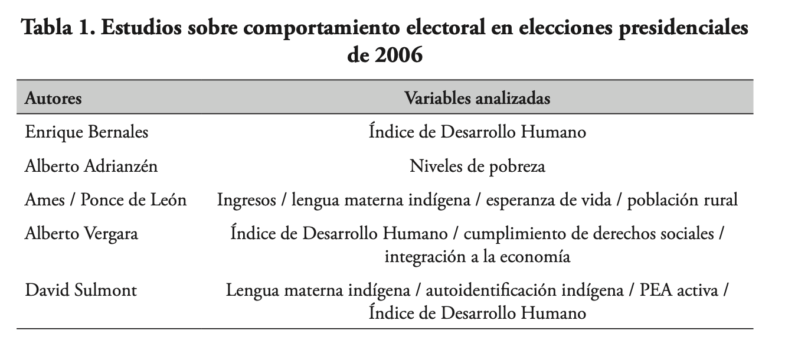
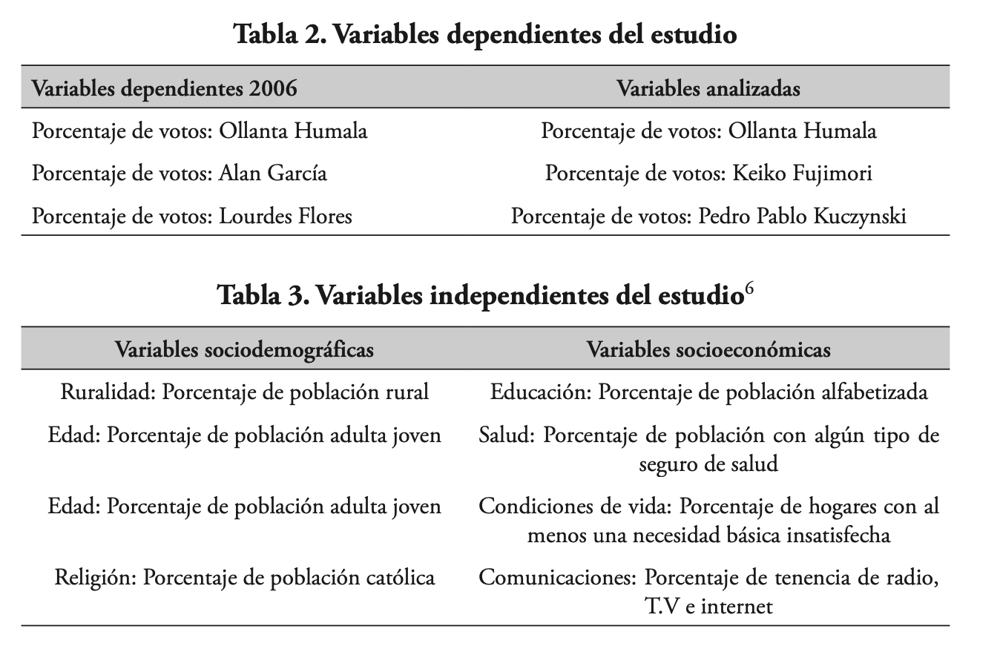
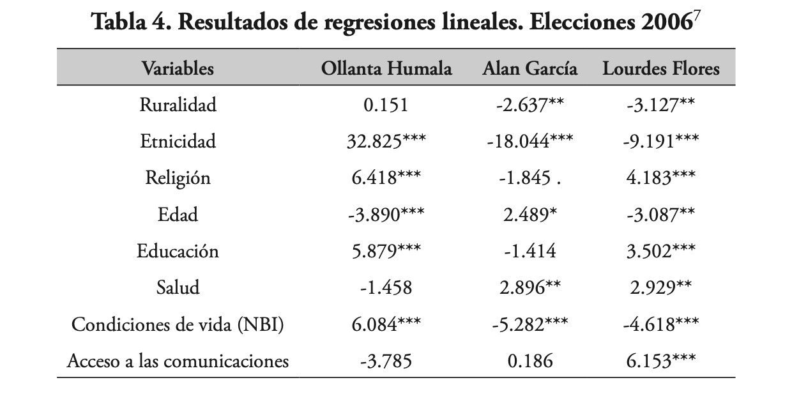
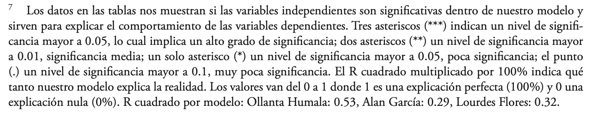

```{r setup, include=FALSE}
knitr::opts_chunk$set(echo = TRUE)
```

# Introducción a la regresión lineal múltiple

-   El análisis bivariado es un primer paso en el análisis estadístico.
    Se encuentran (cor)relaciones: X - Y

-   ¿Por qué agregar más variables?
    Se busca aproximarse a la causalidad: X -\> Y

-   Para aproximarse a establecer causalidad es necesario el análisis multivariado.

-   Para hablar de causalidad, se requieren ciertos criterios:

    -   Asociación estadística entre las variables, pero asociación no implica causalidad.

    -   Orden temporal: que la causa ocurra antes que el efecto.

    -   Eliminación de hipótesis alternativas.
        Estas hipótesis alternativas regularmente parten de la literatura.

    -   Consistencia: la relación debe ser consistente en diferentes estudios, poblaciones y contextos.

    -   Dosificación: cambios en la magnitud de X llevan a cambios correspondientes en Y.

    -   Plausibilidad: debe haber una explicación teórica o mecanismo plausible que respalde la relación causal.

    -   Especificidad: si una causa X lleva a un efecto Y específico y no a múltiples efectos diferentes.

    -   Coherencia: la relación causal debe ser coherente con el conocimiento general existente, por ejemplo en diferentes disciplinas.

# Control estadístico

Para evaluar (o eliminar) las hipótesis alternativas, se realiza un "control estadístico".
La idea es:

-   Evaluar si la asociación entre X - Y permanece si se remueve el efecto de otra variable, es decir, si se controla por una tercera variable (o cuarta o quinta o etc.).

-   Para controlar por variables importantes, como las sociodemográficas.

-   En un experimento se puede controlar por un gran número de variables desde el diseño.
    Por ejemplo, se puede asegurar que el sujeto experimental esté expuesto a las mismas condiciones.
    Control experimental.

-   En los métodos observacionales se puede aproximar un control experimental agrupando las observaciones en grupos de valores iguales o similares de las variables de control.
    Control estadístico.

-   En la práctica, se analiza la relación entre X - Y para valores similares o iguales de una variable Z.
    De esta manera se elimina la influencia de Z en la relación entre X - Y.
    Es un paso en el establecimiento de X -\> Y.

-   Si la relación entre X - Y desaparece cuando se controla por Z, se dice que la relación era espúrea.

Para dar un ejemplo, usaremos los datos de la elección 2016.
Esta base de datos incluye una variable de PBI per cápita en cada departamento.
Con esta variable se ha creado otra variable agrupando el PBI en 3 grupos: alto, medio, bajo.

```{r base}
library(rio)
data16 = import("bases/datos2016_v3.sav")
```

En primer lugar, haremos una inspección visual de la relación entre el acceso a internet y el voto a PPK, mediante un gráfico de dispersión.
Esta gráfico incluirá una tercera variable, PBI per cápita, que se visualizará como un color de cada observación.

```{r dispersion1}
library(ggplot2)
ggplot(data16, aes(x=Uso_internet, y=Voto_PPK_2016_1))+
  geom_point(aes(color=pbipc_grupos))+
  geom_smooth(method=lm, se=F)+ #agregar línea de tendencia
  geom_text(data=data16, aes(label=Dpto), 
            cex=2, nudge_y = 1.1, check_overlap = T)+ #Pata etiquetar los puntos, darles un tamaño, ubicación y prevenir que se sobrepongan
  labs(x="Porcentaje de uso de internet", 
       y="Voto a PPK (1era vuelta 2016)")+ #para etiquetar los ejes
  theme_light()
```

```{r}
library(tidyverse)
data16 = data16 %>%
  mutate(pbigrupo = factor(pbipc_grupos, labels=c("Bajo",
                                                  "Medio", 
                                                  "Alto")))
```

```{r dispersion2}
ggplot(data16, aes(x=Uso_internet, y=Voto_PPK_2016_1))+
  geom_point(aes(color=pbigrupo))+
  geom_smooth(method=lm, se=F)+ #agregar línea de tendencia
  geom_text(data=data16, aes(label=Dpto), 
            cex=2, nudge_y = 1.1, check_overlap = T)+ #Pata etiquetar los puntos, darles un tamaño, ubicación y prevenir que se sobrepongan
  labs(x="Porcentaje de uso de internet", 
       y="Voto a PPK (1era vuelta 2016)")+ #para etiquetar los ejes
  theme_light()
```

El color de cada punto representa un nivel de PBI per cápita: negro significa PBI per cápita departamental bajo, rojo significa PBI per cápita departamental medio y verde significa PBI per cápita departamental alto.

Para analizar visualmente la relación entre acceso a internet y voto a PPK, controlando por el PBI per cápita, se puede analizar evaluar la relación entre X - Y para grupos de Z.
Es decir, se puede evaluar visualmente la relación entre acceso a internet - voto a PPK, en cada grupo de color.

¿Cuál es la relación entre X - Y para el grupo de observaciones en rojo (PBI per cápita departamental bajo)?
Se observa una relación positiva, aunque tenue.

¿Cuál es la relación entre X - Y para el grupo de observaciones en verde (PBI per cápita departamental medio)?
Se observa una relación negativa, contrario a la hipótesis planteada.

¿Cuál es la relación entre X - Y para el grupo de observaciones en azul (PBI per cápita departamental alto)?
Se observa una relación positiva.

Pregunta final: ¿se mantiene la relación entre acceso a internet y voto a PPK en cada grupo de PBI per cápita?

En un extremo, la relación entre X - Y se mantiene (en la misma dirección) para cada grupo de Z.
Si esto es así, se dice que la relación entre X - Y se mantiene controlando por Z.

En el otro extremos, la relación entre X - Y no se mantiene para ningún grupo de Z.
Si esto es así, se dice que la relación entre X - Y es una relación espúrea, que cuando se controla por Z, esta relación bivariada desaparece.

En la práctica, el análisis multivariado analiza si la relación entre X - Y se mantiene "en promedio" para cada grupo de Z.
Para hacer esta evaluación no es suficiente (y a veces, no es necesario) el análisis visual en el diagrama de dispersión, sino que hace falta un modelo estadístico.

# Modelo de regresión lineal múltiple

Se usa un modelo de regresión lineal múltiple para el cálculo de los efectos de varios predictores en una variable dependiente numérica en un mismo modelo.
Por ejemplo, si quisiéramos evaluar la relación entre la variable acceso a internet y la variable PBI per cápita en el voto a PPK, se puede incluir ambas variables independientes en un mismo modelo.

En ese caso, el modelo sería: $\hat{Y} = \hat{\alpha} + \hat{\beta_1}*X_1+\hat{\beta_2}*X_2$

Si la relación bivariada se evalúa en un plano cartesiano, cuando se incluye una tercera variable, el análisis pasa de un plano cartesiano a un espacio cartesiano.
Para fines explicativos, esto se puede graficar en un diagrama de dispersión en tres dimensiones.

```{r 3d}
#Este código NO se evaluará
library(scatterplot3d)
scatterplot3d(x=data16$Uso_internet, y=data16$Voto_PPK_2016_1, z=data16$pbipc_2014)
pairs(data16$Uso_internet ~ data16$Uso_internet+data16$pbipc_2014)
```

En este caso, cada punto estaría ubicado de acuerdo a los valores en las 3 variables.
No es fácil visualizar la relaciones parciales entre X - Y y entre Z - Y.
Una mejor visualización es mirando los lados del cubo.

Uno podría pensar que es suficiente con realizar dos regresiones lineales simples entre cada variable independiente con la dependiente.
Si lo hacemos, tendríamos dos modelos simples.
Para la relación original entre acceso a internet y voto a PPK, se tiene.

```{r ols simple}
modelo1 = lm(data16$Voto_PPK_2016_1 ~ data16$Uso_internet)
summary(modelo1)
```

Y para la segunda variable, se tiene.

```{r ols simple 2}
modelo2 = lm(data16$Voto_PPK_2016_1 ~ data16$pbipc_2014)
summary(modelo2)
```

```{r}
modelo3 = lm(Voto_PPK_2016_1 ~ Analfabetismo_2014, data=data16)
summary(modelo3)
```

Mirando los resultados de ambos modelos lineales simples, se tiene que ambas variables, tanto acceso a internet como PBI, son significativas.
Ambas tienen un efecto directo, es decir, a mayor acceso a internet, mayor voto a PPK en promedio, y a mayor PBI per cápita, mayor voto a PPK en promedio.

Estos modelos, sin embargo, analizan el impacto individual de cada variable, sin ningún tipo de control estadístico.
Los modelos lineales simple, en ese sentido, están más cerca de un análisis de correlación, que de uno de causalidad.

Para tratar de acercarnos al ideal de causalidad, se tiene que controlar por posibles explicaciones alternativas.
La discusión con respecto a la elección 2016 planteaba que el voto a PPK también tenía un componente económico.
Se especulaba que los sectores más beneficiados del boom económico podían votar en mayor medida a favor de PPK.
Si esto es así, la variable de PBI per cápita puede recoger este fenómeno.

La idea es evaluar si la relación entre acceso a internet y voto a PPK se mantiene controlando por una variable económica.
Para esto, se realiza un modelo lineal múltiple usando el voto a PPK como variable dependiente y el acceso a internet y el PBI per cápita como variables independientes, en un mismo modelo.
El comando `lm` permite incluir varios predictores independientes en un mismo modelo con el símbolo +.

```{r ols multiple}
modelo4 = lm(Voto_PPK_2016_1 ~ Uso_internet + Analfabetismo_2014 + pbipc_2014, data=data16)
summary(modelo4)
```

# Leyendo el modelo

## ¿Es válido el modelo?

Como ahora tenemos tres variables independientes, la validez del modelo ya no depende solo de la relación de una variable independiente con la dependiente.
Para evaluar la validez del modelo se tiene que hacer una evaluación general.
Esta evaluación plantea una hipótesis cero que todas las pendientes (o coeficientes) son iguales a cero.

$H0: \beta_1 = \beta_2 = \beta_3 =...\beta_n = 0$ La hipótesis alternativa indica que al menos una pendiente es diferente de cero, lo que indicaría que al menos una variable independiente tiene relación con la variable dependiente.

Para evaluar esta hipótesis se analiza los resultados de la prueba F (en la última línea de resultados del modelo).
El estadístico F = 7.71 tiene un p-value asociado de 0.001.
Este p-value es menor de 0.05, por lo que podemos rechazar la H0 y afirmar que al menos un coeficiente debe ser diferente de cero.

## Test de inferencia: ¿hay relación entre las VIs y la VD?

Esta pregunta se responde para cada variable independiente, evaluación que se hace dentro de un modelo lineal multivariado, donde se controla por el resto de variables.

Cada variable independiente tiene una fila de resultados con su propia prueba de independencia.
Esta pruebas tiene las siguientes hipótesis:

$H0: \beta_1 = 0$ $H0: \beta_2 = 0$

Para la variable uso de internet, la fila correspondiente nos indica que tenemos un coeficiente de -0.06.
Para esta variable el estadístico de la prueba t tiene un p-value de 0.71.
Este p-value es mayor de 0.05, por lo que fallamos en rechazar la H0.
Es decir, se tiene 71% de probabilidades de tener un coeficiente de -0.06, si el verdadero valor del parámetro es 0.
En resumen, con estos valores, no encontramos una relación entre acceso a internet y voto a PPK.

Para la variable, PBI per cápita, tenemos un coeficiente de 0.0003, con un estadístico de la prueba t de 1.98 y un p-value de 0.06.
Con este p-value no podemos rechazar la H0 a un valor crítico de 0.05).
Este p-value no es menos a 0.05, por lo que no sería significativo.
Pero, si se relaja el criterio, este p-value es menor a 0.10.
Es decir, se tiene 6% de probabilidades de observar una pendiente de 0.0003 si la verdadera pendiente fuera 0.
Podemos asumir que esta probabilidad es baja, por lo que podemos concluir que sí existe una relación entre PBI y voto a PPK al 0.1 de valor crítico.

Para la variable de analfabetismo, se tiene un coeficiente de -0.85 con un estadístico de -2.2 y un p-value de 0.04, que es menor que 0.05, por lo que podemos rechazar la H0.
Se concluye que sí existe relación entre analfabetismo y voto a PPK, controlando por otros factores, como riqueza y uso de internet.

En conclusión, la relación entre acceso a internet y voto a PPK, que se había encontrado en el análisis bivariado, no se mantiene en un análisis multivariado, cuando se controla por la variable PBI.
Muy probablemente estemos hablando de una relación espúrea, pues PBI podría tener un efecto tanto en el acceso a internet (departamentos más ricos, tienen familias que pueden pagar por el servicio de internet), como en el voto a PPK (departamentos más ricos, votan en mayor medida a PPK).

## Dirección de la relación

De la misma manera que en análisis bivariado, la dirección de la relación entre las variables independientes y la dependiente está marcado por el signo del coeficiente.

En este caso, se analiza el signo del coeficiente de la variable PBI y analfabetismo.
El signo del coeficiente de PBI es positivo (+), lo que indica que departamentos con un mayor PBI per cápita tendrían un mayor porcentaje de voto a PPK, en promedio.
De El signo del coeficiente de analfabetismo es negativo (-), con lo que se concluye que departamentos que muestran mayor analfabetismo tienen menor voto a PPK, en promedio.

## Ajuste del modelo

De la misma manera que en el análisis bivariado, el ajuste del modelo se entiende como el porcentaje de la variación total de la variable dependiente explicada por las variables independientes.
Este dato se obtiene con el $R^2$.

En nuestro ejemplo se tiene un $R^2 ajustado = 0.47$.
Esta dato indicaría que el modelo que incluye las variables acceso a internet y PBI per cápita explican el 47% de la variación total del voto a PPK.

El $R^2$ ajustado se usa cuando se quiere comparar entre diferentes modelos, ya sea porque se usan diferentes variables o diferente número de variables.
Esto es importante cuando se comparar modelos con diferente número de variables independientes, porque el $R^2$ tiene la característica de aumentar cuando se incluyen más variables independientes.
El $R^2$ ajustado controla por esta inflación artificial.

## Predicción

Para la predicción se tiene que construir la ecuación del modelo.
Esta ecuación se construye con los valores de los coeficientes de todas las variables, así alguna de ellas no haya salido significativa.
A esto se agrega el valor de la constante.

En nuestro ejemplo se tiene la siguiente ecuación, siendo Y el voto a PPK, X1 el acceso a internet y X2 en PBi per cápita:

$$\hat{Y} = 19.2 - 0.06*X_1 - 0.85*X_2 + 0.0003*X_3$$

Para hallar el voto estimado a PPK, se tiene que agregar valores de las tres variables independientes.
Para poder aproximar valores estándar de estas variables, estas se pueden describir.

```{r describir}
data16 %>%
  summarise(max(Uso_internet, na.rm=T), min(Analfabetismo_2014, na.rm=T), 
            max(pbipc_2014, na.rm=T))
```

Por lo tanto, si queremos calcular un voto promedio general estimado a PPK, se podría reemplazar las variables independientes, en su promedio: X1=32.8, X2=7.8 y X3=14946.

$$\hat{Y} = 19.2 - 0.06*32.8 - 0.85*7.8 + 0.0003*14946 = 15.1 % $$

En conclusión, para valores promedio de las variables independientes, el voto estimado a PPK, según el modelo, sería de 15.1%.
Este mismo ejercicio se puede hacer para los valores mínimos, máximos, para algunos percentiles particulares, etc.

Si se quiere predecir el voto a PPK para diferentes valores de una variable independiente, se puede reemplazar dejando las otras variables en el promedio.
Por ejemplo, se quiere calcular el voto estimado a PPK para diferentes valores de analfabetismo.
Lo primero es calcular los valores de analfabetismo a reemplazar.
En este caso usaremos el mínimo, media.
mediana y máximo.

```{r}
data16 %>%
  summarise(min(Analfabetismo_2014, na.rm=T), mean(Analfabetismo_2014, na.rm=T), 
            median(Analfabetismo_2014, na.rm=T), max(Analfabetismo_2014, na.rm=T))
```

Luego, podemos reemplazar estos diferentes valores de analfabetismo, dejando las otras dos variables constantes en el promedio.

```{r}
19.2 - 0.06*32.76 - 0.85*2 + 0.0003*14946
19.2 - 0.06*32.76 - 0.85*6 + 0.0003*14946
19.2 - 0.06*32.76 - 0.85*7.76 + 0.0003*14946
19.2 - 0.06*32.76 - 0.85*17 + 0.0003*14946
```

## Comparando entre variables

En ocasiones se quiere analizar qué variable independiente tiene un mayor efecto sobre la variable dependiente.
Este análisis no se puede hacer simplemente comparando los coeficientes del modelo anterior, debido a que estos coeficientes están en diferentes unidades: acceso a internet en porcentaje y PBI per cápita en soles.

Para poder comparar el efecto de cada variable sobre la variable dependiente, se tiene que calcular los coeficientes estandarizados.
Estos coeficientes son independientes de las unidades de medida.

Para poder calculas los coeficientes estandarizados, se puede usar la librería `jtools`, que cuenta con el comando `summ`, donde se puede especificar `scale=TRUE` para que se presenten los coeficientes estandarizados.

```{r estandar}
library(jtools)
summ(modelo4, scale=T)
```

De acuerdo a estos resultados, la variable independiente que tiene un efecto mayor sobre la variable dependiente es analfabetismo.
Este análisis es mucho más útil cuando tenemos una mayor cantidad de variables independientes y de variables significativas en diferentes unidades de medición.

Para graficar los coeficientes

```{r}
plot_summs(modelo4)
```

# Leyendo resultados académicos

El análisis de regresión lineal multivariado es una de las herramientas académicas más usadas.
Es muy común encontrar tablas, como la que se muestra abajo, con resultados de este tipo.

Un punto importante, además de producir resultados, es saber interpretarlos.
La tabla proviene de la tesis de pregrado de Sebastián Lazo, luego reportada en su artículo "Comportamiento electoral en el Perú: Un análisis del rol de las variables sociodemográficas en las elecciones presidenciales en primera vuelta de 2006 y 2011", disponible [aquí](https://revistas.pucp.edu.pe/index.php/cienciapolitica/article/view/14520).

El artículo hace una revisión de la literatura de los estudios en Perú sobre el comportamiento electoral e identifica las principales variables que se discuten cómo explicativas del voto por ciertos candidatos.

{width="544"}

Luego identifica las variables disponibles y que están relacionadas con el marco teórico.
La unidad de análisis son los distritos del Perú.
Una una variable dependiente por cada candidato y un set de variables independientes, que refieren de alguna manera con la revisión de la literatura.
En los estudios cuantitativos se tiene la restricción de la disponibilidad de la información.
No todos los factores que se hipotetiza que tienen relación con una variable han sido medidos.

{width="524"}

Lazo obtiene los siguientes resultados.
Se muestran los coeficientes, los signos de los coeficientes y asteriscos que indican el nivel de significancia de los resultados.

{width="484"}

Lazo además incluye una nota al pie con los detalles de las significancias y con la fuerza expplicativa de cada modelo mediante el R2.
Se asume que todos los modelos son válidos.

{width="473"}

¿Qué conclusiones se puede tener de estos resultados acerca del perfil de los candidatos?
