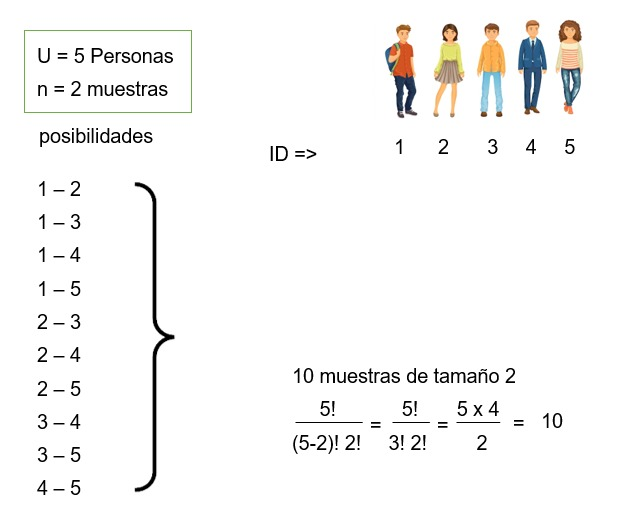
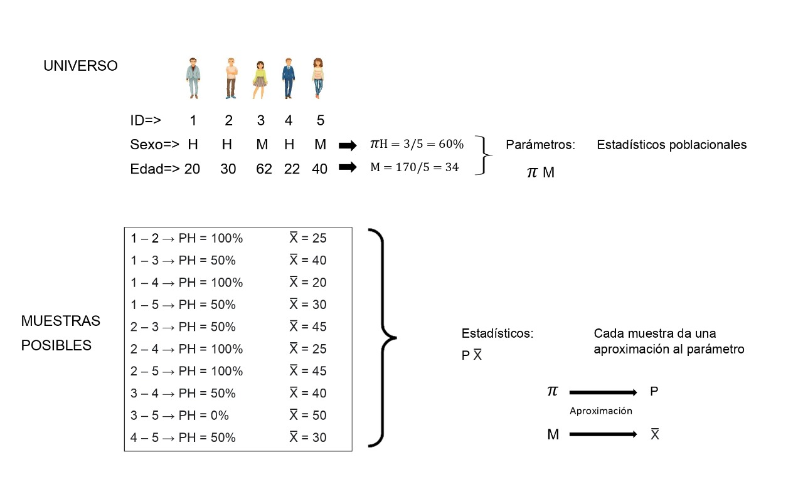
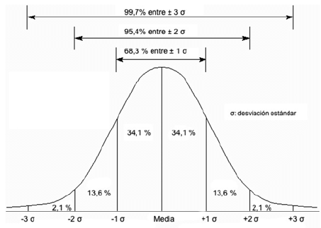
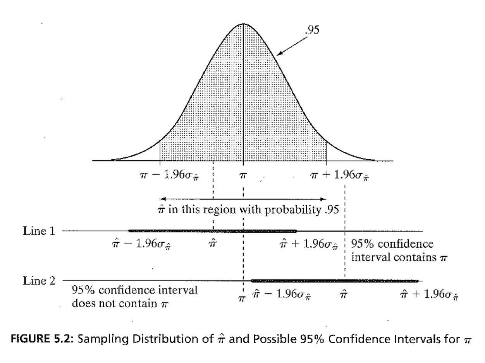
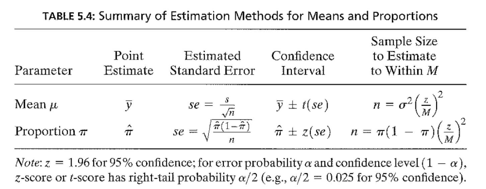

```{r setup, include=FALSE}
knitr::opts_chunk$set(echo = TRUE)
```

------------------------------------------------------------------------

# Visualización

```{r}
library(rio)
res2016 = import("resultados2016.xlsx")
```

Una de las tareas más comunes en el manejo de datos es la visualización de los resultados.
En R hay dos maneras de proceder.
La primera es usar los comandos de base de R.
La otra es usar una librería `ggplot2` que permite una mayor flexibilidad en la producción y estética de los gráficos.

Para esto se carga la librería `ggplot2`.
Esta tiene un comando `ggplot` en el que se define los aspectos del gráfico.
Por ejemplo, para graficar una variable numérica, como el porcentaje de voto a FP por provincia, se puede producir un histograma.

Dentro de este comando se define la base de datos y la variable que se va a graficar.
Luego se van agregando capas.
La primera define el tipo de gráfico.
Usamos `geom_histogram` para producir el histograma y se especifica el ancho de columna.
Luego se define las etiquetas de ejes y el tema del gráfico.

Se observa que el gráfico de porcentaje de votos a Fuerza Popular es aproximadamente simétrico, tal como indicaban la similitud entre media y mediana.

```{r message=FALSE, warning=FALSE}
library(ggplot2)
ggplot(res2016, aes(x=fp))+
  geom_histogram(binwidth = 5)+
  xlab("% Voto PPK 2016") +
  ylab("Frecuencia")+
  theme_minimal()
```

Habíamos encontrado que la media y la mediana del porcentaje de voto al Frente Amplio diferían.
Esto lo comprobamos produciendo el histograma de esta variable.

```{r}
ggplot(res2016, aes(x=fa))+
  geom_histogram(binwidth = 5)+
  geom_vline(xintercept = 29.3, color = "red")+
  geom_vline(xintercept = 24.5, color = "green")+
  xlab("% Voto FA 2011")+
  ylab("Frecuencia")+
  theme_classic()
```

Otro gráfico útil en la visualización es el llamado "boxplot" o "gráfico de cajas".
Este tipo de gráficos sirve bastante para comparar entre grupos de otra variable.

Para producir un gráfico de cajas usamos la especificación `geom_bloxplot()` y podemos definir los límites y saltos del eje Y.
Este gráfico nos muestra que el distrito con el menor porcentaje de voto a FP tuvo un poco más de 5% y que el máximo fue de casi 80%.
También muestra que la votación mediana fue de 40%.
Los límites de la caja son el cuartil 25 y el cuartil 75.

```{r}
ggplot(res2016, aes(y=fp))+
  geom_boxplot()+
  ylab("% Voto FP 2011")
```

El aspecto más útil de los gráficos de cajas es la comparación.
Por ejemplo, si se quisiera comparar el voto a Fuerza Popular entre departamentos del país.
Para hacer esto se debe definir que la variable en el eje Y sea el porcentaje de votos a Fuerza Popular "fp" y en el eje X la variable que define los departamentos "dpto".
Incluimos la especificación `coord_flip()` para voltear los ejes y que las etiquetas de los departamentos se lean más claramente.

En el gráfico se pueden hacer varias comparaciones.
Lo más importante es comparar medianas y anchos de cajas entre departamentos.
Los puntos aislados son "outliers" o valores extremos, que se calculan automáticamente y se grafican.

Este gráfico, sin embargo, es muy desagragado.

```{r}
ggplot(res2016, aes(y=fp, x=dpto))+
  geom_boxplot()+
  scale_y_continuous(limits = c(0, 100), breaks = seq(0, 100, 10))+
  ylab("% Voto FP 2011")+
  xlab("Departamento")+
  theme_minimal()+
  coord_flip()
```

Si se quisiera comparar entre regiones (costa, sierre y selva), se tendría que crear esta variable, a partir de la variable "dpto".

## Recodificando variables

```{r}
library(tidyverse)
res2016 = res2016 |>
  mutate(region = case_when(
    dpto=="AMAZONAS"~3,
    dpto=="ANCASH"~2,
    dpto=="APURIMAC"~2,
    dpto=="AREQUIPA"~2,
    dpto=="AYACUCHO"~2,
    dpto=="CAJAMARCA"~2,
    dpto=="CUSCO"~2,
    dpto=="CALLAO"~1,
    dpto=="HUANCAVELICA"~2,
    dpto=="HUANUCO"~3,
    dpto=="ICA"~1,
    dpto=="JUNIN"~2,
    dpto=="LA LIBERTAD"~1,
    dpto=="LAMBAYEQUE"~1,
    dpto=="LIMA"~1,
    dpto=="LORETO"~3,
    dpto=="MADRE DE DIOS"~3,
    dpto=="MOQUEGUA"~1,
    dpto=="PASCO"~2,
    dpto=="PIURA"~1,
    dpto=="PUNO"~2,
    dpto=="SAN MARTIN"~3,
    dpto=="TACNA"~1,
    dpto=="TUMBES"~1,
    dpto=="UCAYALI"~3
  )) 
```

```{r}
res2016 |>
  count(Region = region, name="Frecuencia")
```

La variable creada es una variable de tipo "numérico".
En R existe otro tipo de variable llamado "factor".
Podemos convertir cualquier variable a una de factor y etiquetar cada valor.

```{r}
library(forcats)
res2016 = res2016 |>
  mutate(region2 = factor(region, labels=c("Costa", "Sierra", "Selva")))
```

Ahora, procedemos a producir el gráfico de cajas de porcentaje de voto a Fuerza Popular por región.

```{r}
ggplot(res2016, aes(y=fp, x=region2))+
  geom_boxplot()+
  scale_y_continuous(limits = c(0, 100), breaks = seq(0, 100, 20))+
  ylab("% Voto FP 2016")+
  xlab("Región")+
  theme_get()
```

Se observa en este gráfico que el voto mediano a Fuerza Popular fue mayor entre provincias de la costa, seguido por la selva y luego la sierra.
Este mismo patrón se observa si calculáramos la media del porcentaje de voto provincial a Fuerza Popular por región.

```{r}
res2016 |> 
  group_by(region2) |>
  summarise(mean(fp), sd(fp))
```

# Caso 1:

*Pregunta: Existe un sentido común que indica que los peruanos no leen. ¿Es aquello cierto? ¿Existen diferencias de género o socioeconómicas en los niveles de lectura?*

Para responder a esta pregunta, usaremos la Encuesta Nacional de Lectura de 2022.

```{r}
library(rio)
enl = import("~/Library/CloudStorage/GoogleDrive-arturo.maldonado@pucp.pe/Mi unidad/A Cursos/Estadistica_1/Data/ENL2022/ENL2022.sav")
```

Esta encuesta tiene una pregunta que indaga directamente (P408).
Cuando se importa los datos a R, esta variable se importa como una variable numérica, cuando en realidad, es una variable de tipo factor.

Se usa el comando `mutate` para crear una nueva variable y el comando `factor` para transformar la variable numérica a una de factor con sus respectivos `labels`.

```{r}
library(tidyverse)
enl = enl |>
  mutate(lee = factor(P408, labels=c("Sí", "No")))
```

## Descripción de variables de factor

Para describir variables que no son numéricas, podemos producir tablas de distribución de frecuencias.
Por ejemplo, podemos describir la variable "lee" de la base de datos.
Podemos usar el comando `count` para calcular la tabla de distribución de frecuencias de esta variable.
Se guarda esta tabla en un objeto "tabla1".

```{r}
tabla1 = enl |>
  filter(lee == "Sí" | lee == "No") |>
  count(Lee = lee, name="Frecuencia")
tabla1
```

Para calcular los porcentajes, se puede agregar a la tabla una columna "Porcentaje" con el cálculo de la "Frecuencia" (columna existente) ente la suma total de las frecuencias.
Se encuentra que Fuerza Popular ganó en el 57% de provincias del Perú.

```{r}
tabla1 = tabla1 |>
  mutate(Porcentaje = (Frecuencia / sum(Frecuencia)*100 ))
tabla1
```

Para graficar una variable de tipo cualitativa (o de factor en el lenguaje de R), se debe usar, por ejemplo, un gráfico de barras.
Podemos graficar estos porcentajes.

Para esto usamos la librería `ggplot2`, pero ahora no realizaremos un histograma (no usaremos `geom_histogram`), sino barras, con `geom_bar`.
Dentro de este comando se añade `stat="identity` para indicar que R no calcule nada y solo use los datos de "tabla".

```{r}
library(ggplot2)
graf1 = ggplot(tabla1, aes(x=Lee,y=Porcentaje))+
  geom_bar(stat="identity", width=0.5)
graf1
```

La encuesta también incluye la pregunta P209 sobre género.
Esta variable se importa como una numérica, por lo que nuevamente la transformamos en una variable de tipo factor "sexo" con sus etiquetas.

```{r}
enl = enl |>
  mutate(sexo = factor(P209, labels=c("Hombre", "Mujer")))
```

Ahora usamos esta variable para calcular las frecuencias y porcentajes por grupos de sexo.

```{r}
tabla2 = enl |>
  filter(lee == "Sí" | lee == "No") |> 
  group_by(sexo) |>
  count(Lee = lee, name="N")|>
  mutate(total = sum(N), 
         Por = N / total * 100)
tabla2
```

La tabla nos indica los porcentajes de los que sí leen y los que no leen por sexo.
Como solo queremos graficar los porcentajes de los que sí leen, podemos eliminar las filas de los que no leen.

```{r}
tabla2 = tabla2[-c(2,4),]
```

Con esta tabla reducida, podemos graficas usando `ggplot`.
Ahora agregamos la capa `geom_text` para incluir el dato del porcentaje dentro del gráfico.

```{r}
graf2 = ggplot(tabla2, aes(x=sexo, y=Por))+
  geom_bar(stat="identity")+
  geom_text(aes(label=paste(round(Por, 1))), vjust=-1, size=3)+
  labs(x="Sexo", y="Porcentaje")+
  theme_classic()
graf2
```

La base de datos incluye una variable "nse", que refiere al nivel socioeconómico de la persona que responde.
Este nivel socioeconómico está categorizado en 4 niveles.

```{r}
enl = enl |>
  mutate(nse = factor(nse, labels=c("Rural", "Bajo", "Medio", "Alto")))
```

Pasamos a calcular los porcentajes de lectura por los 4 niveles socioeconómicos.

```{r}
tabla3 = enl |>
  filter(lee == "Sí" | lee == "No") |> 
  group_by(nse) |>
  count(Lee = lee, name="N")|>
  mutate(total = sum(N), 
         Por = N / total * 100)
tabla3
```

Nuevamente eliminamos las filas de los porcentajes de aquellos que no leen.

```{r}
tabla3 = tabla3[-c(2,4,6,8),]
```

Y graficamos los porcentajes de los que sí leen por niveles socioeconómicos.

```{r}
graf3 = ggplot(tabla3, aes(x=nse, y=Por))+
  geom_bar(stat="identity")+
  geom_text(aes(label=paste(round(Por, 1))), vjust=-1, size=3)+
  labs(x="NSE", y="Porcentaje")+
  theme_classic()
graf3
```

## Tarea

Se encontró que una mayor proporción de mujeres que hombres lee.
¿Cuántos libros impresos y digitales lee el peruano promedio?
¿Existen diferencias entre hombres y mujeres entre el promedio de libros impresos y digitales que leen?
¿Entre niveles socioeconómicos?

# Caso 2: Encuesta Nacional Docente 2020

Cada dos años, el Ministerio de Educación realiza una encuesta a una muestra de docentes de educación básica en el Perú.
La última disponible fue hecha en 2020, en medio de la pandemia del COVID-19.
Las bases de datos y cuestionarios de esta encuesta se encuentran disponibles [aquí](http://www.minedu.gob.pe/politicas/docencia/encuesta-nacional-a-docentes-endo.php).

En esta ubicación se encuentra la base de datos, que puede ser descargada y leída en R con el siguiente código.

```{r endo}
library(rio)
endo2020 = import("bases/ENDO_REMOTO_2020.dta")
#CAMBIAR A PROPIO DIRECTORIO DE TRABAJO
```

# Estimación puntual

De una variable numérica, la medida de tendencia central más útil es la media.
La encuesta a docentes incluye la pregunta:

6.  ¿A cuántos estudiantes le brinda acompañamiento como docente de aula en esta IE? (Ver cuestionario)

De esta pregunta podemos preguntarnos: ¿A cuántos alumnos en promedio acompaña el docente peruano en aula?
Esta encuesta tiene una pregunta que nos permite calcular esta media y la desviación estándar.

```{r desc alumnos, message=FALSE, warning=FALSE}
library(dplyr)
library(tidyverse)
endo2020 |> 
  summarize(Media =mean(P1_6, na.rm = T), Desv.Std = sd(P1_6, na.rm = T))
```

Es decir, un profesor promedio en Perú acompaña aproximadamente a 40 alumnos en aula.
¿Existen diferencias en el número promedio de alumnos que acompañan docentes hombres y docentes mujeres?

Cuando se importa la base de datos, la variable sexo, P1_1, es definida como numérica.

```{r}
str(endo2020$P1_1)
```

La podemos transformar a una variable de tipo factor.

```{r}
endo2020 = endo2020 |>
  mutate(sexo = factor(P1_1, labels=c("Hombre", "Mujer")))
```

Calculamos los datos para hombres y mujeres.

```{r docentes hombre}
tabla1 = endo2020 |> 
  group_by(sexo) |>
  summarize(Media = mean(P1_6, na.rm = T), 
            Desv.Std = sd(P1_6, na.rm = T),
            Mediana = median(P1_6, na.rm = T))
tabla1
```

Se encuentra que los docentes hombres acompañan, en promedio, a 52 alumnos, mientras que las docentes mujeres acompañan a 34 alumnos, una diferencia de 18 alumnos en promedio.

Todos estos resultados son puntuales y aplican para la muestra de 28,216 profesores.

Para una comparación gráfica, se puede usar boxplot.

```{r}
library(ggplot2)
ggplot(endo2020, aes(y=P1_6, x=sexo))+
  geom_boxplot()
```

```{r}
endo2020 = endo2020 |>
  mutate(condicion = factor(P1_7, labels=c("Nombrado", "Contratado x concurso", "Contratado otro")))
```

```{r}
tabla2 = endo2020 |> 
  group_by(condicion) |>
  summarize(Media = mean(P1_6, na.rm = T), 
            Desv.Std = sd(P1_6, na.rm = T),
            Mediana = median(P1_6, na.rm = T))
tabla2
```

```{r}
library(ggplot2)
library(tidyverse)
endo2020 |>
  drop_na(P1_6) |>
  ggplot(aes(y=P1_6, x=condicion))+
  geom_boxplot()
```

```{r}
ggplot(subset(endo2020, !is.na(P1_6)), aes(y=P1_6, x=condicion))+
  geom_boxplot()
```

Si se quiere hacer un gráfico de barras simples para mostrar la media del número de alumnos por sexo del profesor, se puede usar:

```{r}
ggplot(tabla1, aes(x=sexo, y=Media)) + 
  geom_bar(stat = "identity") +
  ggtitle("Número de alumnos promedio por sexo del docente") +
  xlab("Sexo del docente") +
  geom_text(aes(label=round(Media,1)), vjust=1.30, color="white", size=3)+
  theme_minimal()
```

¿Cómo se pueden extrapolar estos resultados al universo de profesores peruanos?

# Estimación por intervalos

Tanto la media muestral, como la proporción muestral, son estimaciones puntuales, basados en los resultados de la muestra.
Es decir, estas son estimaciones correspondientes a las 28,216 observaciones que son parte de este estudio.
Sin embargo, esta muestra forma parte de un universo o población (el conjunto de profesores del Perú), del que seguramente se quiere decir algo.

El mismo razonamiento aplica a una encuesta de opinión convencional.
La ficha técnica de una encuesta menciona, generalmente, el tamaño de muestra y la población a la que se busca representar.
También se puede encontrar el margen de error (+/- 2.8%) y el nivel de confianza (generalmente de 95%).(Ver, por ejemplo, la [encuesta de opinión de agosto 2023 de Ipsos](https://www.ipsos.com/sites/default/files/ct/news/documents/2023-08/Informe%20Encuesta%20Nacional%20Urbano%20Rural%20-%20America%20Televisión%20al%2011%20de%20agosto%202023%20Estudio%20de%20Opinión.pdf).

El proceso mediante el cual se parte de una muestra para decir algo de un universo o población es un proceso de inferencia y es parte de la estadística inferencial.
La estadística inferencial introduce la **incertidumbre** en los estimados, debido al hecho de estar trabajando con una muestra y no con el total de observaciones del universo.

## Un breve paseo por las probabilidades

Partimos del hecho que en el común de las investigaciones uno tiene que seleccionar un conjunto de observaciones que son parte del total, que es muy costoso e ineficiente hacer un estudio de la población completa.
La analogía es, por ejemplo, que para un análisis de sangre se extrae una "muestra" de sangre y no el total de sangre del cuerpo.

A esto le sumamos el hecho que nuestras herramientas de recojo de información son imperfectas.
Un estudio transversal, por ejemplo, debería recoger información de los individuos en un corte en el tiempo, sin embargo, muchos estudios no son una "foto del momento", pues las observaciones toman tiempo y abarcan horas, días o semanas, sino meses.

Es por este motivo que para un estudio se selecciona "una" muestra, un conjunto de observaciones que son una fracción del total.
Esta selección se hace siguiendo procedimientos aleatorios, de tal manera que cualquier unidad del universo tenga la misma probabilidad de ser seleccionada.

El punto es que esta única muestra es solo una de las múltiples muestras teóricas que se podrían seleccionar de un universo determinado.

Partamos de un ejemplo muy simple.
Para un universo de 5 personas, se pueden extraer 10 muestras de tamaño 2 diferentes.



La fórmula para calcular el número de muestras probables es la de combinatorias, que incluye el operador factorial.
Si aplicamos esta fórmula a un ejemplo de un universo más grande, por ejemplo, un salón de clase de 50 alumnos, donde se quiere saber cuántas muestras diferentes de tamaño 4 se pueden extraer.
Según la fórmula:

$$
\frac{50!} {(50-4)! 4!} = \frac{50!} {46! 4!} = \frac{50*49*48*47} {4*3*2} = 230,300
$$

Para un sondeo de opinión, donde el universo son 24 millones de individuos y se quiere saber cuántas muestras diferentes de tamaño 1,500 se pueden extraer, este número de muestras probables es muuuuy grande.

Volviendo al ejemplo muy simple de 5 personas donde se quiere extraer una muestra de 2 y se quiere inferir los datos de la muestra de dos variables: sexo y edad.

Se tiene un universo de 5 individuos, cada uno con su sexo y edad.
En la población la proporción de hombres es de 60% y la media de edad es de 34 años.



Si queremos extraer una muestra de tamaño de 2 de ese universo, se tienen 10 posibles muestras, cada una tendrá una aproximación de la proporción de hombres y de la media de edad.
Dependiendo de qué muestra de todas las posibles sea la que se observa, los estadísticos serán una aproximación de los parámetros poblacionales.

En el caso de la proporción de hombres, se puede tabular los resultados de cada muestra probable.

| Resultados muestrales | Número de muestras que arrojaron ese resultado | Frecuencia |
|:----------------:|:-----------------------------------:|:-----------------|
|          0%           |                       1                        | X          |
|          50%          |                       5                        | XXXXX      |
|         100%          |                       4                        | XXXX       |

Incluso se podría calcular un promedio de todas esas proporciones muestrales (100+50+100+...+50/10), y ese resultado sería 65%, un resultado algo cerca de la proporción poblacional de 60%.

Este mismo procedimiento se podría hacer para todas las 230,300 muestras probables de tamaño 4 de un universo de 50 alumnos.
Cada uno de los 50 alumnos será hombre o mujer y la proporción poblacional de hombres se puede calcular en ese total.
A su vez, cada muestra de 4, tendrá una proporción muestral que tendrá valores (0 si no hay ningún hombre, 25% si hay 1 hombre, 50% si hay 2 hombres, 75% si hay 3 hombres y 100% si todos son hombres).
Finalmente, se puede contar cuántas de las 230,300 muestras probables tuvieron 0%, 25%, 50%, 75% y 100% de hombres.
Esta distribución se llama "**distribución de muestreo**".

Si quisiéramos ampliar el tamaño de muestra a 10, entonces los resultados posibles serían, 0, 10, 20, 30, 40, 50, 60, 70, 80, 90 y 100%.
También podríamos contar cuántas muestras tienen estos resultados.

De un universo más grande, se puede plantear extraer muestras de tamaño más grande.
Por ejemplo, teóricamente se puede pensar que de un universo de 20 millones, se pueden extraer casi infinitas muestras de tamaño 1,500.
Cada una de estas muestras tendrá un estadístico que será una aproximación del parámetro.
Los estadísticos de todas estas casi infinitas muestras se pueden tabular y graficar.

## Teorema del límite central

Este teorema muestra que la **distribución de muestreo se aproxima a una distribución normal**, con centro en el parámetro, en la medida que el tamaño de muestra aumenta.

Esto se puede mostrar gráficamente en el Tablero de Galton, ver [aquí](https://youtu.be/AwEaHCjgeXk?si=a0-wfG-fng4HYsRQ)

Por lo tanto, la distribución de muestreo de N grandes para cualquier variable seguirá las características de cualquier curva normal.
Toda curva normal es simétrica y sabemos que si desde el centro se desplaza 1 desviación estándar en ambas direcciones, entre esos límites estarán el 68.3% de todas las observaciones.
Si se desplaza 2 desviaciones estándar en ambas direcciones, se acumularían el 95.4% de todas las observaciones.
Con 3 desviaciones estándar hacia ambos lados, se acumularía el 99.7% de todas las observaciones.

{width="510"}

Traduciendo a la distribución de muestreo, la idea es que si se tabulan y se hace un gráfico de barras de los resultados de todas las muestras probables, se tendría una curva normal con centro en el parámetro.
Sabríamos que si desde ese centro nos desplazamos 2 desviaciones estándar en ambas direcciones, entre esos límites estarían el 95% de todas las muestra probables.

Es altamente probable (95% probable) que si en una investigación se extrae una sola muestra, esta sea parte del 95% de muestras posibles a +/- 2 desviaciones estándar del parámetro.
De la misma manera, es poco probable (5% probable) que una sola muestra no esté a +/- 2 desviaciones estándar del parámetro.

# Estimación de intervalos de confianza

La distribución de muestreo es teórica, muy difícilmente se puede calcular en la realidad.
Regularmente tampoco sabemos los datos del universo.
Lo que tenemos a mano es **1 muestra observada**.
Es decir, en un estudio de las muuuuuchas muestras probables, se selecciona 1 muestra.

En el caso de la encuesta ENDO, por ejemplo, del universo de profesores peruanos, se seleccionó 1 muestra de 28,216 observaciones, de las muuuuchas muestras de 28,216 individuos de la población total.

Si teóricamente sabemos que en la distribución muestral, el 95% de todas las muestras están a +/- 2 desviaciones estándar[^1] del centro, que coincide con el parámetro poblacional, es muy probable que la única muestra que se ha observado sea parte de ese conjunto.
De hecho, se puede decir que se tiene 95% de probabilidades de que sea parte de ese grupo.

[^1]: En realidad es a +/- 2 errores estándar del centro.
    El error estándar se entiende como la desviación estándar de la distribución de muestreo.

Por lo tanto, si a partir del estadístico muestral, se aplica esta distancia de +/- 2 errores estándar, se tiene 95% de probabilidades que entre esos límites se incluya al valor del parámetro.
Para verlo de manera más visual, en la siguiente figura se tiene la distribución de muestreo teórica (y desconocida), donde se marca la región que acumula el 95% de todas las muestras probables.

Más abajo se marca los resultados de 2 muestras observadas.
La primera proporción muestral subestima la proporción poblacional.
La segunda, por el contrario, sobreestima la proporción poblacional.
En el primer caso, si a partir del estadístico muestral se aplica +/- 1.96 errores estándar (línea horizontal en negrita), se observa que el parámetro poblacional está incluido en esos límites.

Es probable, como en el segundo caso, que otra muestra probable, cuando se le aplique el intervalo de +/- 1.96 errores estándar, no incluya al parámetro.
Se observa que la línea en negrita no incluye la linea vertical entrecortada que marca el valor del parámetro poblacional.

{width="581"}

Sin embargo, sabemos que es mucho más probable (95% de probabilidades) que si una muestra observada es parte del 95% de muestras alrededor del parámetro, este intervalo incluya al parámetro poblacional.
A estos límites le llamamos "intervalos de confianza".

En cualquier investigación solo se cuenta con una muestra observada, cuyo estadístico muestral, sea una media o un proporción, es una aproximación del parámetro poblacional.

Para poder extrapolar desde la muestra hasta la población, se tiene que construir un intervalo de confianza alrededor del estadístico muestral.
Este intervalo se construye aplicando la "distancia" de +/- 1.96 errores estándar, para tener una confianza de 95% de incluir al parámetro poblacional.

Si se está extrapolando para una variable numérica, mediante la media, el error estándar (o se) es:

$$
se = 1.96 * \frac{s} {\sqrt{n}}
$$

Si se está extrapolando para una variable categórica, mediante una proporción, el error estándar (o se) es:

$$
se = 1.96 * \sqrt{\frac{(p * (1-p))} {n}}
$$

A manera de resumen, la siguiente tabla nos muestra el parámetro, el estadístico puntual y el error estándar para cada tipo de variable y cómo se forma el intervalo de confianza.



En estas fórmulas, se usa el símbolo "t" y "z" para referir a las distribuciones teóricas que se usan.
Para fines prácticos, cuando la muestra es grande, ambas distribuciones son iguales.
El valor de "t" o "z" depende del nivel de confianza que queremos.
Es decir, de la probabilidad que queremos de que el intervalo incluya al parámetro.
De esta manera:

-   Z al 90% = 1.645

-   Z al 95% = 1.96

-   Z al 98% = 2.326

-   Z al 99% = 2.576

¿Qué pasa con el IC cuando se quiere mayor confianza?
¿Se vuelve más o menos preciso?

En el ejemplo del cálculo del promedio de alumnos que atiende los profesores, se puede añadir el cálculo de los intervalos de confianza en ambos casos, para hombres y mujeres.
El comando para hacer esto es `ciMean` que es parte de la librería `lsr`.

```{r}
library(lsr)
ciMean(endo2020$P1_6, na.rm = T)
```

Si se calculan los intervalos de confianza por grupos, estos se pueden comparar.

```{r IC docentes}
library(lsr)
ci_alumxsexo = endo2020 |>
  group_by(sexo) |>
  summarise(Media = mean(P1_6, na.rm=T),
            min = ciMean(P1_6, na.rm=T)[1],
            max = ciMean(P1_6, na.rm=T)[2]
            )
ci_alumxsexo
```

Se encuentra que la media de alumnos que atiende un docente hombre esta entre 50.7 y 53.8 alumnos, mientras que en el caso de las docentes mujeres está entre 33.3 y 34.8 alumnos en aula.

¿Qué más se puede decir de esta comparación entre intervalos de confianza?
¿Cómo graficar estos intervalos de confianza?

# Bibliografía
